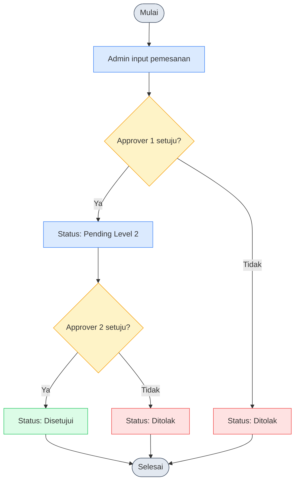
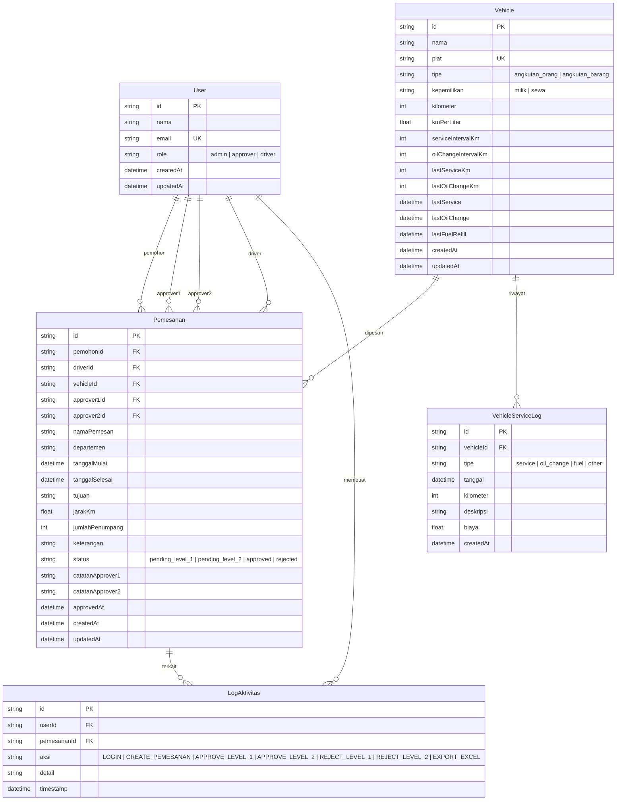

# 🚗 Sistem Pemesanan Kendaraan Operasional

Aplikasi manajemen pemesanan kendaraan operasional dengan sistem approval 2 level untuk lingkungan logistik tambang nikel. Dibangun dengan **Next.js 16 (App Router) + SQLite + Prisma**.

---

## 📋 Daftar Isi

- [Tech Stack](#-tech-stack)
- [Cara Menjalankan](#-cara-menjalankan)
- [Akun & Password](#-akun--password)
- [Fitur](#-fitur)
- [Panduan Penggunaan per Role](#-panduan-penggunaan-per-role)
- [Activity Diagram](#-activity-diagram)
- [Physical Data Model](#-physical-data-model)
- [API Endpoints](#-api-endpoints)
- [Struktur Proyek](#-struktur-proyek)

---

## 🛠 Tech Stack

| Komponen | Teknologi |
|----------|-----------|
| **Framework** | Next.js 16 (App Router) |
| **Bahasa** | TypeScript |
| **Database** | SQLite (file-based, via Prisma) |
| **ORM** | Prisma 6 |
| **UI Library** | shadcn/ui + Tailwind CSS 4 |
| **Grafik** | Recharts |
| **Export Excel** | SheetJS (xlsx) |
| **Font** | Inter |

---

## 🚀 Cara Menjalankan

### Prasyarat
- Node.js 20.x+
- pnpm (recommended) / npm / yarn

### Instalasi & Running

```bash
# 1. Install dependencies
pnpm install

# 2. Setup database (migrasi + seed data)
pnpm prisma migrate dev
pnpm seed

# 3. Jalankan dev server
pnpm dev
```

Buka **http://localhost:3000** di browser.

---

## 👤 Akun & Password

Aplikasi menggunakan sistem **login tanpa password** — cukup pilih user dari daftar yang tersedia.

### Daftar User (Seed Data)

| Nama | Role | Email |
|------|------|-------|
| Admin Utama | **Admin** | admin@company.com |
| Budi Santoso | **Approver** | approver1@company.com |
| Siti Rahmawati | **Approver** | approver2@company.com |
| Ahmad Supriyadi | **Driver** | driver1@company.com |
| Dodi Kurniawan | **Driver** | driver2@company.com |
| Rudi Hermawan | **Driver** | driver3@company.com |

> **⚠️ Catatan:** Aplikasi tidak memerlukan password. Cukup klik nama user pada dialog login untuk masuk.

### Daftar Kendaraan (Seed Data)

| Kendaraan | Plat | Tipe | Kepemilikan | KM |
|-----------|------|------|-------------|-----|
| Toyota Avanza | B 1234 CD | Angkutan Orang | Milik | 45.230 |
| Honda CRV | B 5678 EF | Angkutan Orang | Milik | 28.300 |
| Suzuki Ertiga | B 9012 GH | Angkutan Orang | Sewa | 18.900 |
| Mitsubishi Pajero | B 3456 IJ | Angkutan Barang | Milik | 67.800 |
| Isuzu Elf | B 7890 KL | Angkutan Barang | Milik | 89.200 |

---

## ✨ Fitur

### 📊 Dashboard
- **Statistik ringkasan**: Total pemesanan, pending Level 1 & 2, disetujui, ditolak
- **Grafik batang**: Pemesanan per status
- **Grafik batang horizontal**: Pemesanan per departemen
- **Line chart**: Trend pemesanan bulanan
- **Tabel kendaraan**: Status terkini semua kendaraan
- **Export Excel**: Download laporan pemesanan format `.xlsx`

### 📝 Manajemen Pemesanan
- Form pemesanan kendaraan dengan validasi
- Pilih driver, kendaraan, approver 1 & 2
- **Auto-fill jarak**: Ketik nama kota tujuan, jarak dari Jakarta otomatis terisi (via Nominatim API + Haversine)
- Cegah pemilihan approver yang sama (approver 1 ≠ approver 2)
- Notifikasi sukses/gagal

### 🚛 Manajemen Kendaraan
- **Card view**: Lihat status, KM, sisa service, kepemilikan
- **Filter & search**: Cari berdasarkan nama/plat, filter status
- **Tambah kendaraan baru**
- **Detail kendaraan**: Riwayat service, grafik pengeluaran
- **Catat service**: Service rutin, ganti oli, isi BBM
- **Status otomatis**: `aman` (sisa >2000km), `service` (≤2000km), `danger` (lewat)

### ✅ Approval 2 Level
- **Pending Level 1**: Approver 1 menyetujui/menolak
- **Pending Level 2**: Approver 2 menyetujui/menolak
- **Catatan approval**: Approver bisa memberi alasan
- **Riwayat approval**: 10 data terakhir approve/reject
- Hanya approver/admin yang bisa melakukan aksi

### 📜 Log Aktivitas
- **Audit trail**: Setiap aksi tercatat (login, buat pemesanan, approve, reject, export excel)
- **Filter**: Cari berdasarkan aksi, user, atau kata kunci
- **User avatar + role badge** tampilan per log

### 🗺 Distance Auto-Calculate
- Gunakan **OpenStreetMap Nominatim** untuk geocoding
- Hitung jarak menggunakan **rumus Haversine**
- Tampilkan estimasi jarak langsung di form pemesanan

---

## 📖 Panduan Penggunaan per Role

### Admin
1. Login sebagai **Admin Utama**
2. **Dashboard** → Lihat statistik, grafik, export Excel
3. **Pemesanan Baru** → Buat pemesanan kendaraan untuk departemen mana pun
4. **Kendaraan** → Tambah/edit kendaraan, catat service, filter status
5. **Approval** → Approve/tolak pemesanan (Admin bisa approve level 1 & 2)
6. **Log Aktivitas** → Lihat seluruh aktivitas sistem

### Approver
1. Login sebagai **Budi Santoso** (Approver 1) atau **Siti Rahmawati** (Approver 2)
2. **Approval** → Lihat antrian pending yang sesuai levelnya
3. Klik **Setuju** atau **Tolak** — lengkapi dengan catatan jika perlu
4. **Dashboard** → Monitor status pemesanan

### Driver
1. Login sebagai salah satu driver (Ahmad/Dodi/Rudi)
2. **Dashboard** → Lihat jadwal pemesanan yang menugaskan dirinya
3. Tidak bisa membuat pemesanan atau melakukan approval (read-only di beberapa menu)

---

## 🔄 Activity Diagram

Berikut adalah alur approval berjenjang 2 level untuk proses pemesanan kendaraan:



**Alur lengkap:**
1. Admin membuat pemesanan → status `pending_level_1`
2. Approver 1 menyetujui → status `pending_level_2`
3. Approver 2 menyetujui → status `approved` ✅
4. Jika salah satu approver menolak → status `rejected` ❌

---

## 🗄 Physical Data Model



### Spesifikasi Database

| Item | Detail |
|------|--------|
| **Database** | SQLite |
| **Version** | SQLite 3.x (via Prisma) |
| **PHP Version** | _Not Applicable_ (Next.js / Node.js 20.x) |
| **Framework** | Next.js 16 (Full-stack TypeScript) |

---

## 🔌 API Endpoints

| Method | Endpoint | Deskripsi |
|--------|----------|-----------|
| `GET` | `/api/users` | Daftar semua user |
| `POST` | `/api/users` | Tambah user baru |
| `GET` | `/api/vehicles` | Daftar kendaraan (termasuk status & service logs) |
| `POST` | `/api/vehicles` | Tambah kendaraan baru |
| `GET` | `/api/pemesanan` | Daftar semua pemesanan |
| `POST` | `/api/pemesanan` | Buat pemesanan baru |
| `PATCH` | `/api/pemesanan/[id]` | Approve/reject pemesanan |
| `GET` | `/api/logs` | Daftar log aktivitas (200 terbaru) |
| `POST` | `/api/logs` | Catat log baru |
| `GET` | `/api/distance?tujuan=` | Hitung jarak dari Jakarta ke kota tujuan |

---

## 📁 Struktur Proyek

```
tes-teknikal/
├── app/
│   ├── api/
│   │   ├── distance/route.ts      # Hitung jarak (OpenStreetMap)
│   │   ├── logs/route.ts          # CRUD log aktivitas
│   │   ├── pemesanan/
│   │   │   ├── route.ts           # CRUD pemesanan
│   │   │   └── [id]/route.ts     # Approve/reject per ID
│   │   ├── users/route.ts        # CRUD user
│   │   └── vehicles/
│   │       ├── route.ts           # CRUD kendaraan
│   │       └── [id]/route.ts     # Detail & service kendaraan
│   ├── globals.css
│   ├── layout.tsx
│   └── page.tsx                   # Halaman utama (SPA)
├── components/
│   ├── atoms/                     # Komponen dasar
│   │   ├── StatCard.tsx
│   │   ├── StatusBadge.tsx
│   │   └── UserAvatar.tsx
│   ├── molecules/                 # Komponen menengah
│   │   ├── LoginDialog.tsx
│   │   ├── VehicleCard.tsx
│   │   ├── TambahVehicleDialog.tsx
│   │   ├── VehicleDetailDialog.tsx
│   │   ├── ServiceModal.tsx
│   │   └── ApprovalActionDialog.tsx
│   ├── organisms/                 # Komponen halaman
│   │   ├── AppLayout.tsx
│   │   ├── DashboardSection.tsx
│   │   ├── PemesananFormSection.tsx
│   │   ├── KendaraanSection.tsx
│   │   ├── ApprovalSection.tsx
│   │   └── LogSection.tsx
│   └── ui/                        # shadcn/ui components
├── lib/
│   ├── db.ts                      # Prisma client & helper
│   ├── types.ts                   # Type definitions & config
│   ├── utils.ts                   # Utility functions
│   └── vehicle-utils.ts           # Status kendaraan helpers
└── prisma/
    ├── schema.prisma              # Database schema
    ├── seed.ts                    # Data awal
    └── dev.db                     # File database SQLite
```
