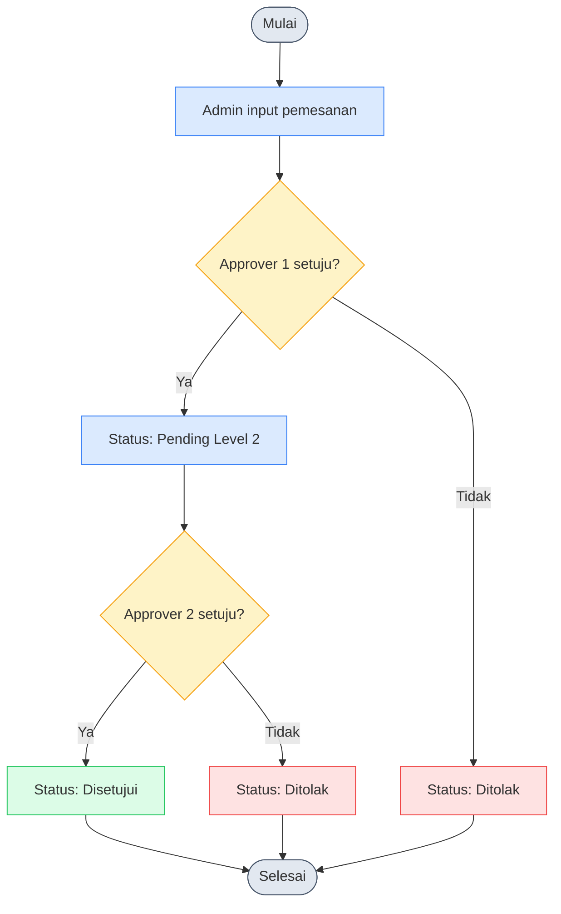
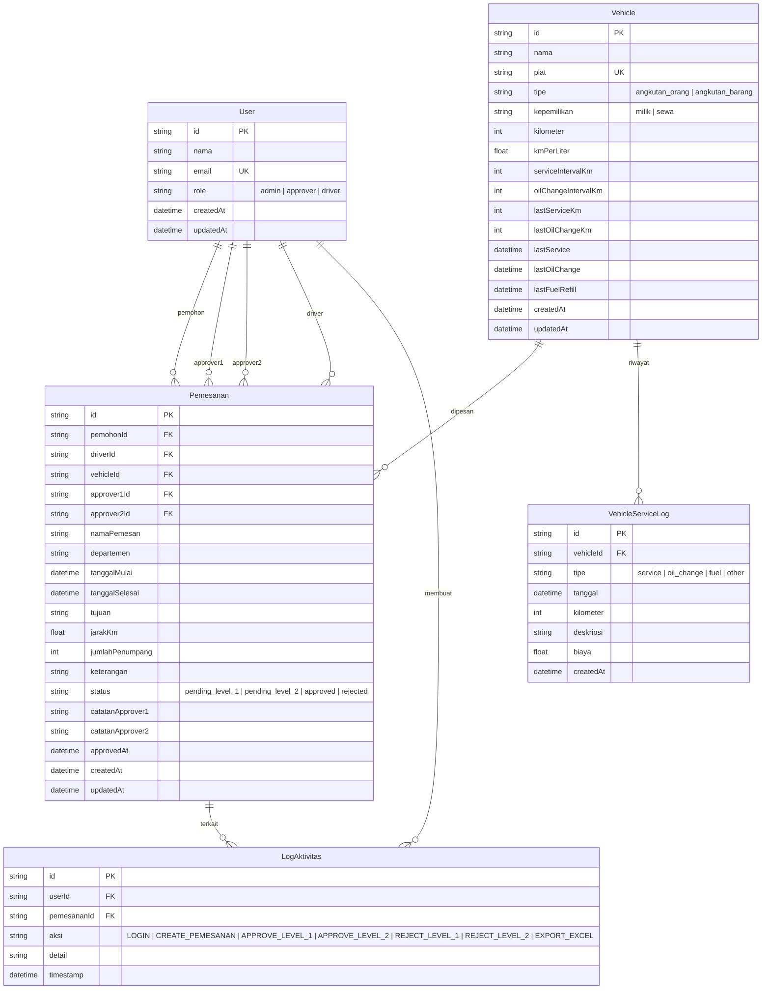

# 📖 Dokumentasi Sistem Pemesanan Kendaraan

> 📘 **Panduan penggunaan lengkap dari 0 ke 100%** → [`PENGGUNAAN.md`](./PENGGUNAAN.md)

- [Panduan Penggunaan per Role](#-panduan-penggunaan-per-role)
- [Activity Diagram](#-activity-diagram)
- [Physical Data Model](#-physical-data-model)
- [API Endpoints](#-api-endpoints)
- [Struktur Proyek](#-struktur-proyek)

---

## 📖 Panduan Penggunaan per Role

### Admin
1. Login sebagai **Admin Utama**
2. **Dashboard** → Lihat statistik, grafik, export Excel
3. **Pemesanan Baru** → Buat pemesanan kendaraan
4. **Kendaraan** → Tambah/edit kendaraan, catat service, filter status
5. **Approval** → Approve/tolak pemesanan (bisa level 1 & 2)
6. **Log Aktivitas** → Lihat seluruh aktivitas sistem

### Approver
1. Login sebagai **Budi Santoso** (Approver 1) atau **Siti Rahmawati** (Approver 2)
2. **Approval** → Lihat antrian pending sesuai level
3. Klik **Setuju** atau **Tolak** — lengkapi catatan jika perlu
4. **Dashboard** → Monitor status pemesanan

### Driver
1. Login sebagai salah satu driver
2. **Dashboard** → Lihat jadwal pemesanan
3. Bersifat read-only di sebagian menu

---

## 🔄 Activity Diagram



---

## 🗄 Physical Data Model



### Spesifikasi Database

| Item | Detail |
|------|--------|
| **Database** | SQLite 3.x (via Prisma) |
| **PHP Version** | _Not Applicable_ (Node.js 20.x / Next.js) |
| **Framework** | Next.js 16 (Full-stack TypeScript) |

---

## 🔌 API Endpoints

| Method | Endpoint | Deskripsi |
|--------|----------|-----------|
| `GET` | `/api/users` | Daftar semua user |
| `POST` | `/api/users` | Tambah user baru |
| `GET` | `/api/vehicles` | Daftar kendaraan |
| `POST` | `/api/vehicles` | Tambah kendaraan baru |
| `GET` | `/api/vehicles/[id]` | Detail kendaraan |
| `PATCH` | `/api/vehicles/[id]` | Update kendaraan / catat service |
| `DELETE` | `/api/vehicles/[id]` | Hapus kendaraan |
| `GET` | `/api/pemesanan` | Daftar pemesanan |
| `POST` | `/api/pemesanan` | Buat pemesanan baru |
| `PATCH` | `/api/pemesanan/[id]` | Approve/reject pemesanan |
| `GET` | `/api/logs` | Log aktivitas (200 terbaru) |
| `POST` | `/api/logs` | Catat log baru |
| `GET` | `/api/distance?tujuan=` | Hitung jarak Jakarta → kota tujuan |

---

## 📁 Struktur Proyek

```
tes-teknikal/
├── app/
│   ├── api/
│   │   ├── distance/route.ts       # Hitung jarak (OpenStreetMap)
│   │   ├── logs/route.ts           # CRUD log aktivitas
│   │   ├── pemesanan/
│   │   │   ├── route.ts            # CRUD pemesanan
│   │   │   └── [id]/route.ts      # Approve/reject
│   │   ├── users/route.ts          # CRUD user
│   │   └── vehicles/
│   │       ├── route.ts            # CRUD kendaraan
│   │       └── [id]/route.ts      # Detail & service
│   ├── globals.css
│   ├── layout.tsx
│   └── page.tsx
├── components/
│   ├── ui/          # shadcn/ui
│   ├── layout/      # AppLayout
│   ├── template/    # Dashboard, Approval, Kendaraan, Log, PemesananForm
│   └── shared/      # StatCard, VehicleCard, LoginDialog, dll
├── lib/
│   ├── db.ts        # Prisma client
│   ├── types.ts     # Type definitions
│   ├── utils.ts     # Utility functions
│   └── vehicle-utils.ts
└── prisma/
    ├── schema.prisma
    ├── seed.ts
    └── dev.db
```
